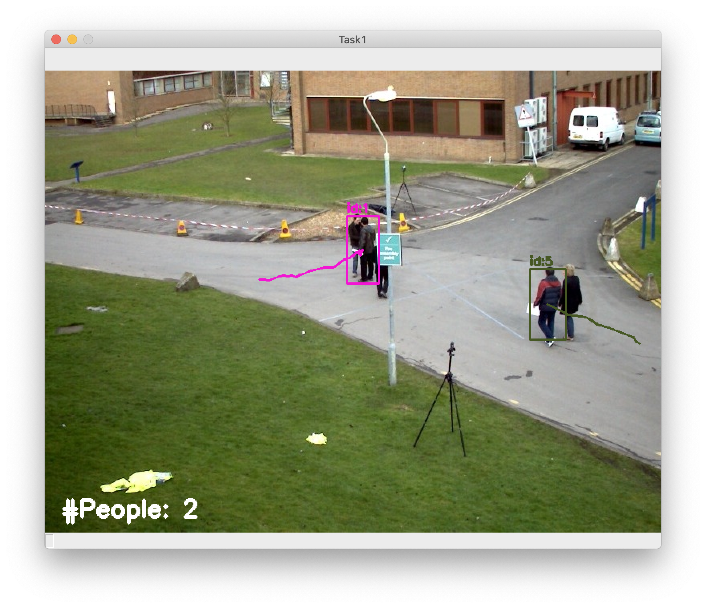

# How to run this project

## Task 1

Go to the task1 directory, type these commands:

1.  Installing necessary dependencies

    ```
    cd task1
    git clone https://github.com/abewley/sort.git
    wget -P ./yolov3 https://pjreddie.com/media/files/yolov3-tiny.weights
    pip install -r requirements.txt 
    ```

2.  Run the `task1.py`

    ```
    python task1.py
    ```

3.  You will see a window pop out like this

    

4.  To quit, simply press q.